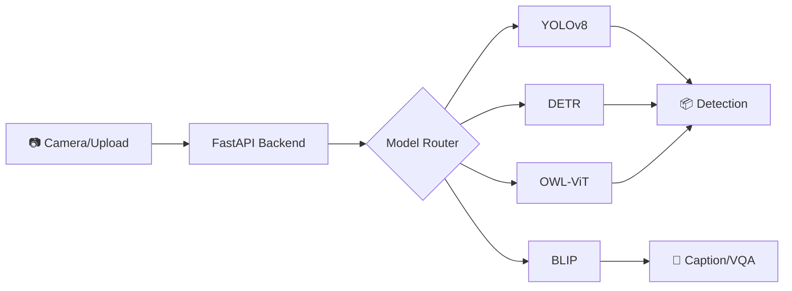

<div align="center">

<!-- PROJECT LOGO/BANNER -->


<h1 align="center">🎯 YOLO-Toys</h1>

<p align="center">
  <strong>Multi-Model Real-Time Vision Recognition Platform</strong>
</p>

<p align="center">
  FastAPI · YOLOv8 · Transformers · WebSocket Streaming
</p>

<!-- BADGES -->
<p align="center">
  <a href="https://github.com/LessUp/yolo-toys/actions/workflows/ci.yml">
    
  </a>
  <a href="https://github.com/LessUp/yolo-toys/actions/workflows/security.yml">
    
  </a>
  <a href="https://github.com/LessUp/yolo-toys/actions/workflows/pages.yml">
    
  </a>
  <a href="LICENSE">
    
  </a>
  <br>
  
  
  
  
  
</p>

<p align="center">
  <a href="README.zh-CN.md">简体中文</a> ·
  <a href="https://lessup.github.io/yolo-toys/"><strong>🌐 Live Demo</strong></a> ·
  <a href="https://lessup.github.io/yolo-toys/docs/">📚 Documentation</a> ·
  <a href="https://github.com/LessUp/yolo-toys/issues">🐛 Issues</a> ·
  <a href="CONTRIBUTING.md">🤝 Contributing</a>
</p>

</div>

---

## 🚀 What is YOLO-Toys?

**YOLO-Toys** is a production-ready, multi-model vision recognition platform that unifies state-of-the-art vision models under a single, easy-to-use API.



### ✨ Key Features

<table>
<tr>
<td width="33%">

**🎯 Detection**
- YOLOv8 (n/s/m/l/x)
- DETR ResNet-50/101
- 80 COCO classes
- Real-time inference

</td>
<td width="33%">

**🖼️ Segmentation**
- Instance segmentation
- Pixel-perfect masks
- Panoptic support
- Contour extraction

</td>
<td width="33%">

**🏃 Pose Estimation**
- 17-keypoint detection
- Skeleton tracking
- Multi-person support
- Confidence scoring

</td>
</tr>
<tr>
<td width="33%">

**🔍 Open Vocabulary**
- OWL-ViT zero-shot
- Grounding DINO
- Text-prompted detection
- No training required

</td>
<td width="33%">

**📝 Multimodal AI**
- BLIP image captioning
- Visual question answering
- Scene understanding
- Natural language output

</td>
<td width="33%">

**⚡ Performance**
- WebSocket streaming
- TTL+LRU model caching
- Prometheus metrics
- <5ms GPU latency

</td>
</tr>
</table>

---

## 🎬 Quick Demo

<p align="center">
  <a href="https://lessup.github.io/yolo-toys/">
    
  </a>
</p>

```bash
# 🐳 One-liner with Docker
docker run -p 8000:8000 ghcr.io/lessup/yolo-toys:latest

# Visit http://localhost:8000 and grant camera access!
```

---

## 📦 Installation

### Prerequisites
- Python 3.11+ or Docker
- 4GB+ RAM (8GB recommended for large models)
- Optional: CUDA 11.8+ for GPU acceleration

### Option 1: Python (Development)

```bash
# Clone repository
git clone https://github.com/LessUp/yolo-toys.git
cd yolo-toys

# Create virtual environment
python -m venv .venv && source .venv/bin/activate  # Linux/macOS
# python -m venv .venv && .venv\Scripts\activate   # Windows

# Install & run
pip install -r requirements.txt
make run  # or: uvicorn app.main:app --reload
```

### Option 2: Docker Compose (Production)

```bash
cp .env.example .env
docker-compose up --build -d
```

### Option 3: Pre-built Image

```bash
docker pull ghcr.io/lessup/yolo-toys:latest
docker run -p 8000:8000 ghcr.io/lessup/yolo-toys:latest
```

---

## 🔌 API Usage

### REST API

```bash
# Single image inference
curl -X POST "http://localhost:8000/infer" \
  -F "file=@image.jpg" \
  -F "model=yolov8n.pt" \
  -F "conf=0.25"
```

### WebSocket Streaming

```javascript
const ws = new WebSocket(
  'ws://localhost:8000/ws?model=yolov8n.pt&conf=0.25'
);

// Send JPEG frames
ws.send(imageBlob);

// Receive real-time results
ws.onmessage = (event) => {
  const { detections, inference_time } = JSON.parse(event.data);
  console.log(`Detected ${detections.length} objects in ${inference_time}ms`);
};
```

### Response Format

```json
{
  "width": 640,
  "height": 480,
  "task": "detect",
  "detections": [
    {
      "bbox": [100.5, 200.3, 150.8, 350.2],
      "score": 0.89,
      "label": "person"
    }
  ],
  "inference_time": 5.2,
  "model": "yolov8n.pt"
}
```

---

## ⚡ Performance

Benchmarks on RTX 3060 @ 640x480:

| Model | Task | Latency | FPS |
|-------|------|---------|-----|
| YOLOv8n | Detection | ~5ms | ~200 |
| YOLOv8s | Detection | ~6ms | ~167 |
| YOLOv8n-seg | Segmentation | ~10ms | ~100 |
| DETR-R50 | Detection | ~25ms | ~40 |
| OWL-ViT | Zero-shot | ~30ms | ~33 |

> 💡 **Pro Tip**: Enable FP16 (`half=true`) for 2x speedup on CUDA devices!

---

## 🏗️ Architecture

```
┌─────────────────────────────────────────────────────────────┐
│                      Frontend (Browser)                     │
│         Camera · Canvas · WebSocket · HTTP                  │
└─────────────────────────────┬───────────────────────────────┘
                              │
┌─────────────────────────────▼───────────────────────────────┐
│                    FastAPI Backend                          │
│  ┌─────────────┐  ┌─────────────┐  ┌─────────────┐         │
│  │   REST API  │  │  WebSocket  │  │  /metrics   │         │
│  └──────┬──────┘  └──────┬──────┘  └─────────────┘         │
└─────────┼────────────────┼──────────────────────────────────┘
          │                │
          ▼                ▼
┌─────────────────────────────────────────────────────────────┐
│                   ModelManager (TTL+LRU Cache)              │
└─────────────────────────────┬───────────────────────────────┘
                              │
    ┌─────────┬─────────┬─────┴──────┬──────────┬─────────┐
    ▼         ▼         ▼            ▼          ▼         ▼
┌──────┐ ┌────────┐ ┌────────┐ ┌──────────┐ ┌───────┐ ┌────────┐
│ YOLO │ │ DETR   │ │OWL-ViT │ │Grounding │ │ BLIP  │ │ SAM    │
│v8    │ │ResNet50│ │        │ │  DINO    │ │CAP/VQA│ │        │
└──────┘ └────────┘ └────────┘ └──────────┘ └───────┘ └────────┘
```

**Core Patterns:**
- 🔀 **Strategy Pattern**: Pluggable handlers for different model types
- 💾 **TTL+LRU Caching**: Automatic memory pressure management
- 📊 **Prometheus Metrics**: Built-in observability
- 🔄 **Async Concurrency**: Semaphore-based request throttling

---

## 📚 Documentation

| Resource | English | 中文 |
|----------|---------|------|
| 📖 Quick Start | [Installation](docs/getting-started/installation.md) · [Quick Start](docs/getting-started/quickstart.md) | [安装](docs/getting-started/installation.zh-CN.md) · [快速开始](docs/getting-started/quickstart.zh-CN.md) |
| 🔌 API Reference | [REST API](docs/api/rest-api.md) · [WebSocket](docs/api/websocket.md) | [REST API](docs/api/rest-api.zh-CN.md) · [WebSocket](docs/api/websocket.zh-CN.md) |
| 🏗️ Architecture | [Overview](docs/architecture/overview.md) | [系统概述](docs/architecture/overview.zh-CN.md) |
| 🐳 Deployment | [Docker](docs/deployment/docker.md) | [Docker部署](docs/deployment/docker.zh-CN.md) |

Full documentation: **https://lessup.github.io/yolo-toys/docs/**

---

## 🛠️ Development

```bash
# Setup
pip install -r requirements-dev.txt
pre-commit install

# Common commands
make lint       # Run Ruff linting
make test       # Run pytest
make format     # Auto-fix code style
make run        # Start dev server
```

### Environment Variables

| Variable | Default | Description |
|----------|---------|-------------|
| `MODEL_NAME` | `yolov8s.pt` | Default model ID |
| `CONF_THRESHOLD` | `0.25` | Detection confidence threshold |
| `DEVICE` | `auto` | Inference device (cpu/cuda:0/mps) |
| `MAX_CONCURRENCY` | `4` | Max concurrent requests |
| `CACHE_TTL` | `3600` | Model cache TTL (seconds) |

---

## 🤝 Contributing

Contributions are welcome! Please read our [Contributing Guide](CONTRIBUTING.md).

```bash
# Fork and clone
git clone https://github.com/your-username/yolo-toys.git
cd yolo-toys

# Create feature branch
git checkout -b feat/amazing-feature

# Commit and push
git commit -m "feat: add amazing feature"
git push origin feat/amazing-feature

# Open Pull Request
```

---

## 📄 License

This project is licensed under the [MIT License](LICENSE).

---

## 🙏 Acknowledgments

- [Ultralytics YOLOv8](https://github.com/ultralytics/ultralytics) — State-of-the-art detection
- [HuggingFace Transformers](https://github.com/huggingface/transformers) — Open-source ML
- [FastAPI](https://fastapi.tiangolo.com/) — Modern web framework
- [Just the Docs](https://just-the-docs.com/) — Documentation theme

---

<div align="center">

**[🌐 Live Demo](https://lessup.github.io/yolo-toys/)** · **[📚 Docs](https://lessup.github.io/yolo-toys/docs/)** · **[🐛 Issues](https://github.com/LessUp/yolo-toys/issues)**

If you find this project helpful, please give us a ⭐!


</div>
