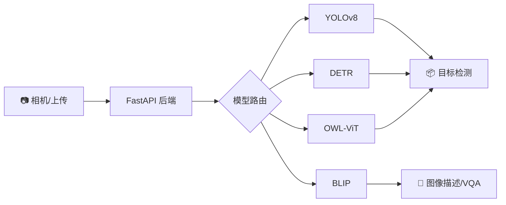

<div align="center">

<!-- PROJECT LOGO/BANNER -->


<h1 align="center">🎯 YOLO-Toys</h1>

<p align="center">
  <strong>多模型实时视觉识别平台</strong>
</p>

<p align="center">
  FastAPI · YOLOv8 · Transformers · WebSocket 流式传输
</p>

<!-- BADGES -->
<p align="center">
  <a href="https://github.com/LessUp/yolo-toys/actions/workflows/ci.yml">
    
  </a>
  <a href="https://github.com/LessUp/yolo-toys/actions/workflows/security.yml">
    
  </a>
  <a href="https://github.com/LessUp/yolo-toys/actions/workflows/pages.yml">
    
  </a>
  <a href="LICENSE">
    
  </a>
  <br>
  
  
  
  
  
</p>

<p align="center">
  <a href="README.md">English</a> ·
  <a href="https://lessup.github.io/yolo-toys/"><strong>🌐 在线演示</strong></a> ·
  <a href="https://lessup.github.io/yolo-toys/docs/">📚 项目文档</a> ·
  <a href="https://github.com/LessUp/yolo-toys/issues">🐛 问题反馈</a> ·
  <a href="CONTRIBUTING.md">🤝 参与贡献</a>
</p>

</div>

---

## 🚀 YOLO-Toys 是什么？

**YOLO-Toys** 是一个生产级的多模型视觉识别平台，将最先进的视觉模型统一到一个简单易用的 API 中。



### ✨ 核心特性

<table>
<tr>
<td width="33%">

**🎯 目标检测**
- YOLOv8 (n/s/m/l/x)
- DETR ResNet-50/101
- 80 类 COCO 目标
- 实时推理

</td>
<td width="33%">

**🖼️ 实例分割**
- 像素级掩膜分割
- 全景分割支持
- 轮廓提取
- 精准边界

</td>
<td width="33%">

**🏃 姿态估计**
- 17 关键点检测
- 骨架追踪
n- 多人支持
- 置信度评分

</td>
</tr>
<tr>
<td width="33%">

**🔍 开放词汇**
- OWL-ViT 零样本检测
- Grounding DINO
- 文本提示检测
- 无需训练

</td>
<td width="33%">

**📝 多模态 AI**
- BLIP 图像描述
- 视觉问答 VQA
- 场景理解
- 自然语言输出

</td>
<td width="33%">

**⚡ 高性能**
- WebSocket 流式传输
- TTL+LRU 模型缓存
- Prometheus 监控
- GPU <5ms 延迟

</td>
</tr>
</table>

---

## 🎬 快速体验

<p align="center">
  <a href="https://lessup.github.io/yolo-toys/">
    
  </a>
</p>

```bash
# 🐳 Docker 一行命令运行
docker run -p 8000:8000 ghcr.io/lessup/yolo-toys:latest

# 访问 http://localhost:8000，授予摄像头权限即可开始！
```

---

## 📦 安装

### 环境要求
- Python 3.11+ 或 Docker
- 4GB+ 内存（大型模型建议 8GB）
- 可选：CUDA 11.8+ 以获得 GPU 加速

### 方式 1：Python（开发推荐）

```bash
# 克隆仓库
git clone https://github.com/LessUp/yolo-toys.git
cd yolo-toys

# 创建虚拟环境
python -m venv .venv && source .venv/bin/activate  # Linux/macOS
# python -m venv .venv && .venv\Scripts\activate     # Windows

# 安装并运行
pip install -r requirements.txt
make run  # 或: uvicorn app.main:app --reload
```

### 方式 2：Docker Compose（生产推荐）

```bash
cp .env.example .env
docker-compose up --build -d
```

### 方式 3：预构建镜像

```bash
docker pull ghcr.io/lessup/yolo-toys:latest
docker run -p 8000:8000 ghcr.io/lessup/yolo-toys:latest
```

---

## 🔌 API 使用

### REST API

```bash
# 单张图片推理
curl -X POST "http://localhost:8000/infer" \
  -F "file=@image.jpg" \
  -F "model=yolov8n.pt" \
  -F "conf=0.25"
```

### WebSocket 流式传输

```javascript
const ws = new WebSocket(
  'ws://localhost:8000/ws?model=yolov8n.pt&conf=0.25'
);

// 发送 JPEG 帧
ws.send(imageBlob);

// 接收实时结果
ws.onmessage = (event) => {
  const { detections, inference_time } = JSON.parse(event.data);
  console.log(`${inference_time}ms 内检测到 ${detections.length} 个目标`);
};
```

### 响应格式

```json
{
  "width": 640,
  "height": 480,
  "task": "detect",
  "detections": [
    {
      "bbox": [100.5, 200.3, 150.8, 350.2],
      "score": 0.89,
      "label": "person"
    }
  ],
  "inference_time": 5.2,
  "model": "yolov8n.pt"
}
```

---

## ⚡ 性能表现

RTX 3060 @ 640x480 基准测试：

| 模型 | 任务 | 延迟 | FPS |
|------|------|------|-----|
| YOLOv8n | 检测 | ~5ms | ~200 |
| YOLOv8s | 检测 | ~6ms | ~167 |
| YOLOv8n-seg | 分割 | ~10ms | ~100 |
| DETR-R50 | 检测 | ~25ms | ~40 |
| OWL-ViT | 零样本 | ~30ms | ~33 |

> 💡 **专业提示**：在 CUDA 设备上启用 FP16（`half=true`）可获得 2 倍加速！

---

## 🏗️ 架构设计

```
┌─────────────────────────────────────────────────────────────┐
│                      前端层 (浏览器)                         │
│              相机 · Canvas · WebSocket · HTTP               │
├─────────────────────────────────────────────────────────────┤
│                      FastAPI 后端                            │
│  ┌─────────────┐  ┌─────────────┐  ┌─────────────┐         │
│  │   REST API  │  │  WebSocket  │  │  /metrics   │         │
│  └──────┬──────┘  └──────┬──────┘  └─────────────┘         │
├─────────┼────────────────┼──────────────────────────────────┤
│         │                │                                  │
│         ▼                ▼                                  │
│  ┌─────────────────────────────────────────────────────┐   │
│  │           ModelManager (TTL+LRU 缓存)                │   │
│  └──────────────────────────┬──────────────────────────┘   │
│                             │                               │
│  ┌─────────┬─────────┬─────┴──────┬──────────┬─────────┐   │
│  ▼         ▼         ▼            ▼          ▼         ▼   │
│ ┌──────┐ ┌────────┐ ┌────────┐ ┌──────────┐ ┌───────┐ ┌────────┐
│ │ YOLO │ │ DETR   │ │OWL-ViT │ │Grounding │ │ BLIP  │ │  SAM   │
│ │v8    │ │ResNet50│ │        │ │  DINO    │ │CAP/VQA│ │        │
│ └──────┘ └────────┘ └────────┘ └──────────┘ └───────┘ └────────┘
└─────────────────────────────────────────────────────────────┘
```

**核心设计模式：**
- 🔀 **策略模式**：可插拔处理器适配不同模型类型
- 💾 **TTL+LRU 缓存**：自动内存压力管理
- 📊 **Prometheus 监控**：内置可观测性
- 🔄 **异步并发**：基于信号量的请求限制

---

## 📚 文档资源

| 资源 | English | 中文 |
|------|---------|------|
| 📖 快速开始 | [安装](docs/getting-started/installation.md) · [快速开始](docs/getting-started/quickstart.md) | [安装指南](docs/getting-started/installation.zh-CN.md) · [快速开始](docs/getting-started/quickstart.zh-CN.md) |
| 🔌 API 参考 | [REST API](docs/api/rest-api.md) · [WebSocket](docs/api/websocket.md) | [REST API](docs/api/rest-api.zh-CN.md) · [WebSocket](docs/api/websocket.zh-CN.md) |
| 🏗️ 架构设计 | [系统概述](docs/architecture/overview.md) | [系统概述](docs/architecture/overview.zh-CN.md) |
| 🐳 部署指南 | [Docker](docs/deployment/docker.md) | [Docker部署](docs/deployment/docker.zh-CN.md) |

完整文档：**https://lessup.github.io/yolo-toys/docs/**

---

## 🛠️ 开发指南

```bash
# 环境设置
pip install -r requirements-dev.txt
pre-commit install

# 常用命令
make lint       # 运行 Ruff 代码检查
make test       # 运行测试
make format     # 自动修复代码风格
make run        # 启动开发服务器
```

### 环境变量

| 变量 | 默认值 | 说明 |
|------|--------|------|
| `MODEL_NAME` | `yolov8s.pt` | 默认模型 ID |
| `CONF_THRESHOLD` | `0.25` | 检测置信度阈值 |
| `DEVICE` | `auto` | 推理设备 (cpu/cuda:0/mps) |
| `MAX_CONCURRENCY` | `4` | 最大并发请求数 |
| `CACHE_TTL` | `3600` | 模型缓存 TTL（秒） |

---

## 🤝 参与贡献

欢迎贡献！请阅读我们的 [贡献指南](CONTRIBUTING.md)。

```bash
# Fork 并克隆
git clone https://github.com/your-username/yolo-toys.git
cd yolo-toys

# 创建特性分支
git checkout -b feat/amazing-feature

# 提交并推送
git commit -m "feat: 添加新功能"
git push origin feat/amazing-feature

# 创建 Pull Request
```

---

## 📄 开源协议

本项目采用 [MIT 协议](LICENSE) 开源。

---

## 🙏 致谢

- [Ultralytics YOLOv8](https://github.com/ultralytics/ultralytics) — 先进的目标检测框架
- [HuggingFace Transformers](https://github.com/huggingface/transformers) — 开源机器学习库
- [FastAPI](https://fastapi.tiangolo.com/) — 现代 Web 框架
- [Just the Docs](https://just-the-docs.com/) — 文档主题

---

<div align="center">

**[🌐 在线演示](https://lessup.github.io/yolo-toys/)** · **[📚 文档](https://lessup.github.io/yolo-toys/docs/)** · **[🐛 问题反馈](https://github.com/LessUp/yolo-toys/issues)**

如果本项目对你有帮助，请给我们一颗 ⭐！


</div>
